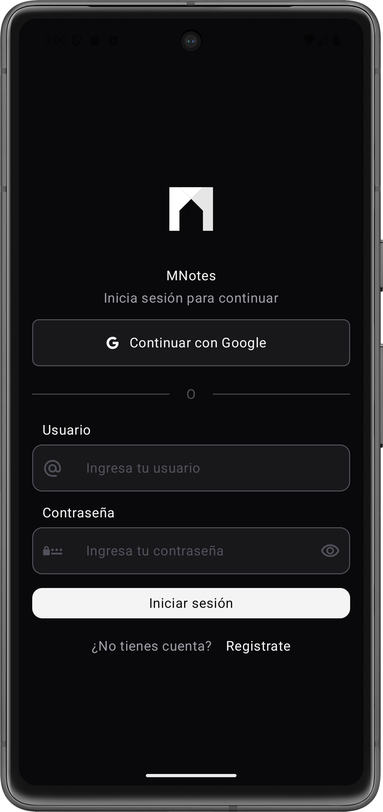
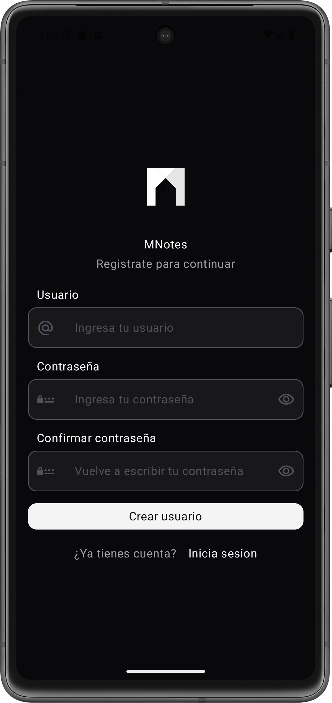
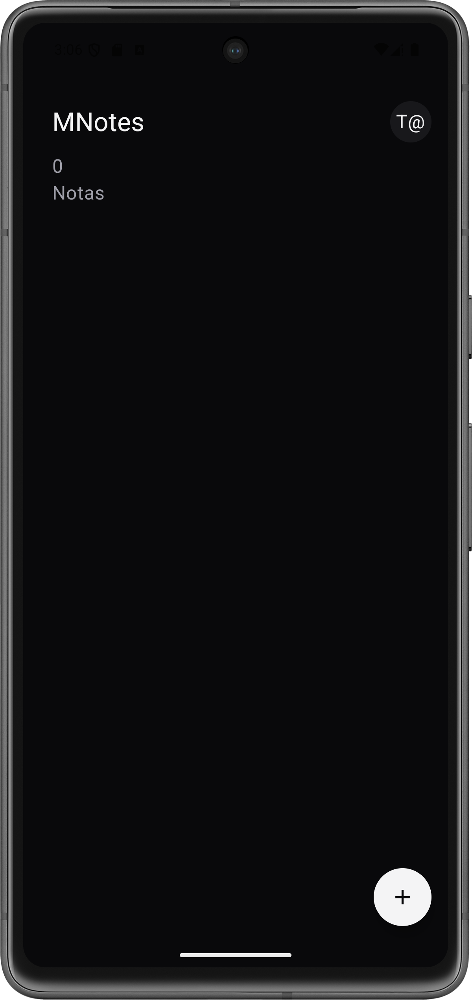
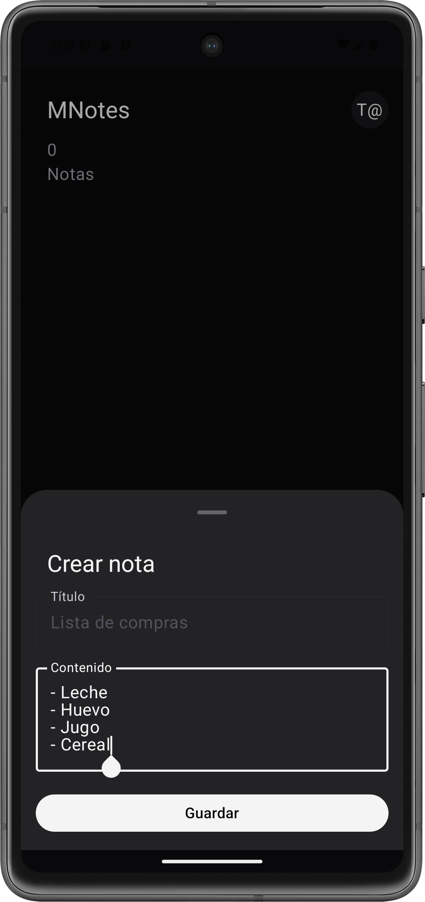
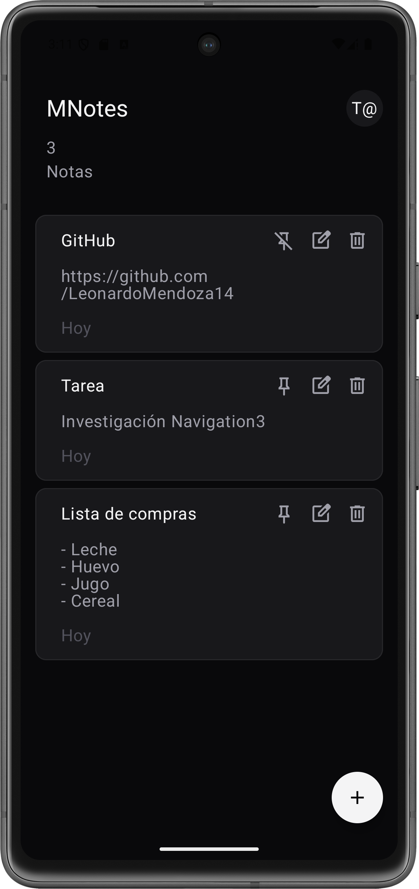
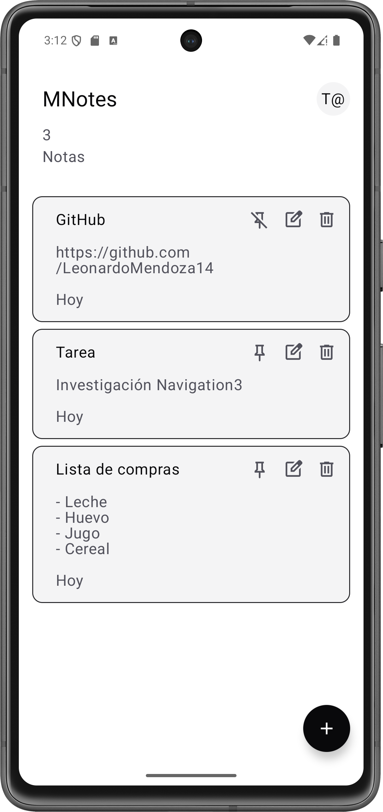

# MNotes
    

    

     

   

El objetivo de este proyecto fue resolver problemas complejos de ingeniería móvil: Sincronización en tiempo real, persistencia offline, condiciones de carrera en concurrencia y optimización de recomposiciones en la UI.

     

## Caracteristicas clave

**1. Arquitectura Offline-First Real**

- La aplicación no requiere internet para funcionar. Utiliza la persistencia local de Firestore junto con Flow y addSnapshotListener para garantizar que el usuario siempre vea datos, sin importar la conectividad.

- Sincronización Silenciosa: Los cambios locales se aplican instantáneamente (Optimistic UI) y se sincronizan en background cuando la red se recupera.

- Resolución de Conflictos: Implementación de estrategias de Merge para evitar sobrescritura de datos entre dispositivos.

**2. Patrón Híbrido MVVM + MVI**

- Se utiliza la estructura de MVVM para la supervivencia del ciclo de vida, pero la comunicación con la UI sigue el patrón MVI (Model-View-Intent) estricto.

- Estado Único (Single Source of Truth): HomeState y SettingsState son inmutables.

- Eventos: La UI no llama funciones, emite intenciones (HomeEvent.AddNote, SettingsEvent.ChangeTheme).

- Beneficio: Elimina estados inconsistentes y hace que el flujo de datos sea unidireccional y fácil de testear.

**3. Manejo Avanzado de Concurrencia**

- Se pone especial énfasis en evitar Race Conditions y Crashes comunes en Android:

- Logout Seguro: Implementación de cancelación síncrona de Jobs y Listeners antes de cerrar la sesión de Auth, evitando el error PERMISSION_DENIED común en Firestore.

- Jobs Gestionados: Uso de Job manuales para cancelar suscripciones anteriores al cambiar de usuario o recargar configuraciones, evitando fugas de memoria y lecturas duplicadas.

**4. Optimización de UI (Compose Performance)**

- Lambda Stability: Uso de remember { { ... } } para mantener la estabilidad de las lambdas y evitar recomposiciones innecesarias en componentes estáticos como TopBars y ListItems.

- Listas Eficientes: LazyColumn optimizado con key y componentes ligeros.

## Estructura del proyecto
```
com.mendoxy.mnotes
├── data                # Capa de Datos (Impl)
│   ├── remote          # Firebase (Firestore, Auth)
│   ├── mapper          # Mappers (Entity <-> Model)
│   └── repository      # Implementación de Repositorios
├── domain              # Capa de Dominio (Pura Kotlin)
│   ├── model           # Data Classes limpias
│   ├── repository      # Interfaces
│   └── useCase         # Lógica de Negocio Unitaria
├── ui                  # Capa de Presentación
│   ├── presentation    # ViewModels (MVI) y Screens
│   ├── theme           # Sistema de Diseño Dinámico
│   └── utils           # Extensiones y Helpers
└── di                  # Módulos de Hilt
```

## 👨‍💻 Autor

[Leonardo Mendoza]
Desarrollador Android apasionado por la arquitectura limpia y la experiencia de usuario.

[](https://www.linkedin.com/in/leonardomendoza14/)

Este proyecto fue desarrollado como parte de mi portafolio profesional para demostrar dominio sobre corrutinas, maquetado, personalización, bases de datos, sincronización, concurrencia y patrones de diseño modernos.
